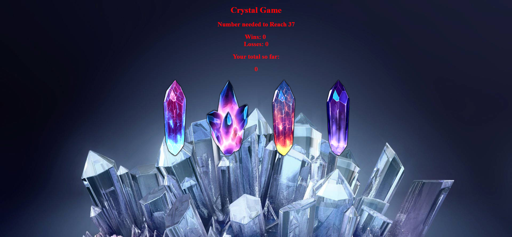

# Crystal Game

1. This game has the player guess the answer.
* There will be four crystals displayed on the screen.

* There will be a random number displayed on the screen.

* When a player clicks a crystal there will be a specific number of points added to their total.

* The player will win if their total scor mataches the random number that was generated.

* The player will lose if their scor goes over the random number.

* The game also resets if the player wins or losses.

